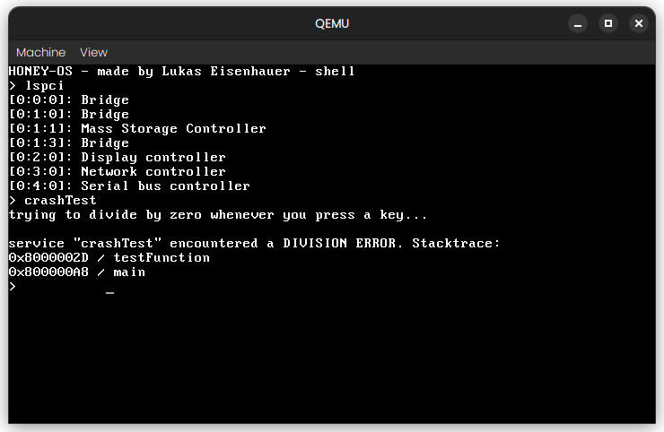

# Honey OS

Honey os is an open suorce operating system and kernel. 

## Building

The ´dependencies´ file contains a list of AUR packages that should be installed when runnung Honey-OS. To install them all, use your package manager (paru in this example) like this:

    cat dependencies | paru -S -

To build the OS and run in an emulator, run

    make

Sometime when modifying __hlib__, things can break. In this event, clear all build files using

    make clean

and try building __honey-os__ again.

## Directory structure

The `rootfs` directory contains all files for the 'root file system' of the final iso. It contains the final honey os kernel executable file as well as necessary grub configuration files.

The `initrd` directory will be created during the building process as a temporary directory. This is later packed into a `.tar` file and will be loaded by grub. After booting, the kernel will be able to load additional user mode programs from this 'initial ramdisk', before other file system drivers have been initialized to load programs from the boot drive.

`src/kernel` contains all files which are compiled into the finished kernel.

`src/userland` contains several directories with source files to compile different ELF user programs. The Makefile at `src/userland/Makefile` and the accompanying `src/userland/link.ld` are the default method of building the userland files. The compiled binary will have the same name as the folder its source files are located in, so source files in `src/userland/shell/` will all be compiled and linked into an ELF file at `initrd/shell`, then packed into `rootfs/initrd.tar` and then inserted into the `.iso` file.

All userspace programms are currently loaded into the virtual address `0x80000000` by default, but honey-os principally supports loading them anywhenre.

The compiled object files for userland programs are stored in `src/userland/build/`

`src/hlib` is the honey OS utility library. It is linked by default with all loaded user mode programs at a high memory address (0xFF000000). And can be linked with and assumed to be loaded by any other program, because it will be loaded first.

`src/include` has some `.h` that are shared by all userspace programs and supported by __hlib__.
